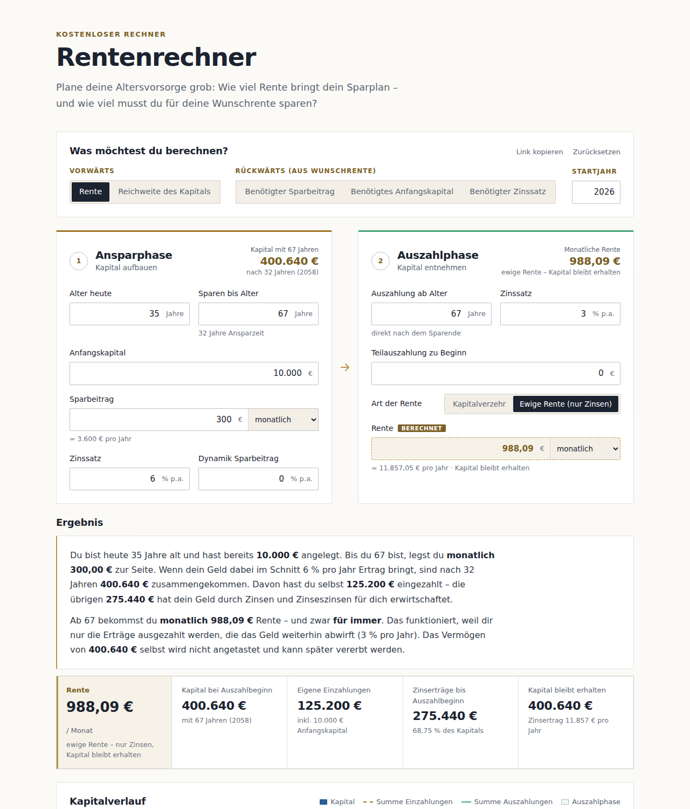

# Rentenrechner

[](https://github.com/joshuamaier/rentenrechner/actions/workflows/test.yml)
[](LICENSE)

Ein einfacher, kostenloser Rentenrechner, um die private Altersvorsorge grob zu planen: Wie viel Rente
bringt ein Sparplan – und wie viel muss man für eine Wunschrente sparen? Links steht die **Ansparphase**,
rechts die **Auszahlphase**. Darunter folgen ein verständlich formuliertes Ergebnis, eine Grafik des
Kapitalverlaufs und eine Tabelle mit den Werten pro Jahr.

**Live ausprobieren:** [joshuamaier.de/blog/rentenrechner.html](https://joshuamaier.de/blog/rentenrechner.html)



## Funktionen

- **Vorwärts rechnen:** aus dem Sparplan die mögliche Rente oder die Reichweite des Kapitals
- **Rückwärts rechnen:** aus einer Wunschrente den nötigen Sparbeitrag, das nötige Anfangskapital oder
  den nötigen Zinssatz
- **Auszahlphase** als ewige Rente (nur die Erträge werden entnommen) oder als Kapitalverzehr über eine
  feste Dauer, mit Teilauszahlung, Restkapital und jährlicher Steigerung
- **Ergebnis in Alltagssprache**, das die Eingaben wiederholt und ohne Fachbegriffe erklärt
- **Plausibilitätshinweise** bei unrealistischen Annahmen, etwa sehr hohen Renditen
- Grafik mit Tooltip, Jahrestabelle mit CSV-Export, teilbarer Link mit allen Eingaben
- Läuft vollständig im Browser: keine Anmeldung, keine Datenübertragung, keine Abhängigkeiten zur Laufzeit

## Schnellstart

Der Rechner ist eine statische Seite ohne Build-Schritt. `index.html` direkt im Browser öffnen oder
einen lokalen Server starten:

```bash
npm start   # http://localhost:8080
```

## Entwicklung

Voraussetzung ist Node.js ab Version 18.

```bash
npm install          # Werkzeuge für Tests, Lint und Formatierung
npm test             # Tests des Rechenkerns und der Hinweise
npm run lint         # ESLint (JavaScript) und html-validate (HTML)
npm run format       # Formatierung mit Prettier
npm run check        # alles zusammen, wie in der CI
```

Die Formatierung folgt Prettier (`.prettierrc.json`, Zeilenlänge 120, einfache Anführungszeichen),
Einrückung und Zeilenenden legt `.editorconfig` fest. Jeder Push und jeder Pull Request durchläuft per
GitHub Actions Lint, Formatprüfung und Tests.

## In eine andere Seite einbetten

Alle Stile hängen an der Wurzelklasse `.rr`. Der Rechner lässt sich deshalb ohne Konflikte in eine
bestehende Seite einsetzen:

1. `css/rentenrechner.css` und die vier Dateien aus `js/` kopieren.
2. Den Inhalt von `<main class="seite rr">` aus `index.html` in ein Element mit der Klasse `rr`
   übernehmen. Die IDs der Felder werden vom Skript gebraucht.
3. `rentenrechner.css` einbinden und am Seitenende `rechner.js`, `diagramm.js`, `hinweise.js` und
   `app.js` in dieser Reihenfolge laden.

`css/seite.css` enthält nur Kopf und Fuß der eigenständigen Seite. Als Schrift dient Inter, falls die
Seite sie mitbringt, sonst die Systemschrift. Die Eingaben werden erst nach der ersten Änderung in den
URL-Hash geschrieben, die Adresse der umgebenden Seite bleibt beim Laden also unverändert.

## Aufbau

```
┌──────────────────────────────────────────────────────────────┐
│ Was möchtest du berechnen?          Link kopieren · Reset    │
│ Vorwärts [Rente|Reichweite]  Rückwärts [Sparbeitrag|         │
│ Anfangskapital|Zinssatz]                           Startjahr │
├───────────────────────────┬──────────────────────────────────┤
│ 1 Ansparphase   [Kapital] │ 2 Auszahlphase    [Rente/Alter]  │
│  Alter heute / Sparen bis │  Auszahlung ab Alter / Zinssatz  │
│  Anfangskapital           │  Teilauszahlung / Restkapital    │
│  Sparbeitrag + Rhythmus   │  Art: Kapitalverzehr | Ewig      │
│  Zinssatz / Dynamik       │  Dauer der Auszahlung            │
│                           │  Rente + Rhythmus / Dynamik      │
├───────────────────────────┴──────────────────────────────────┤
│ Ergebnis in Alltagssprache (+ Plausibilitätshinweise)        │
│ Kennzahl-Kacheln                                             │
├──────────────────────────────────────────────────────────────┤
│ Grafik: Kapitalverlauf, Summe Ein-/Auszahlungen, Phasen      │
├──────────────────────────────────────────────────────────────┤
│ Tabelle: Werte pro Jahr (+ CSV-Export)                       │
└──────────────────────────────────────────────────────────────┘
```

Die Kopfzeilen der Phasen zeigen die Hauptergebnisse: das angesparte Kapital und die Rente, beim Ziel
„Reichweite“ das Alter, bis zu dem die Rente reicht. Das berechnete Feld ist im Formular als
**„berechnet“** markiert und schreibgeschützt. Beim Wechsel des Rechenziels wird das bisherige Ergebnis
zur neuen Eingabe: Wer zuerst die Rente berechnet und dann „Benötigter Sparbeitrag“ wählt, erhält
denselben Sparbeitrag und kann die Wunschrente von dort aus verändern. Voreingestellt ist die ewige Rente.

### Rechenziele

| Ziel                      | Gegeben                          | Berechnet                                        |
| ------------------------- | -------------------------------- | ------------------------------------------------ |
| Rente                     | Sparplan, Dauer bzw. ewige Rente | Rente                                            |
| Reichweite des Kapitals   | Sparplan, Rente                  | Wie lange das Kapital reicht (oder „unbegrenzt“) |
| Benötigter Sparbeitrag    | Wunschrente, übrige Werte        | Sparbeitrag                                      |
| Benötigtes Anfangskapital | Wunschrente, übrige Werte        | Anfangskapital                                   |
| Benötigter Zinssatz       | Wunschrente, übrige Werte        | Zinssatz der Ansparphase                         |

## Rechenmodell

- Simulation in **Monatsschritten** mit dem **konformen Monatszins** `iₘ = (1 + p)^(1/12) − 1`. Der
  eingegebene Zinssatz entspricht damit der effektiven Jahresrendite, unabhängig vom Zahlungsrhythmus.
- Alle Zahlungen sind **nachschüssig**, fallen also am Ende der Periode an. Der Rechenkern unterstützt
  auch vorschüssige Zahlungen (`vorschuessig: true`), die Oberfläche bietet das bewusst nicht an.
- **Ruhephase:** Liegt der Auszahlbeginn nach dem Sparende, wächst das Kapital ohne Beiträge mit dem
  Zinssatz der Ansparphase weiter.
- **Teilauszahlung:** wird zu Beginn der Auszahlphase vor der ersten Rente entnommen.
- **Kapitalverzehr:** Die Rente wird so bestimmt, dass nach der Auszahldauer genau das gewünschte
  Restkapital übrig bleibt. Mit Rentendynamik steigt die Rate jährlich.
- **Ewige Rente:** Es wird nur der Zinsertrag ausgezahlt, das Kapital bleibt konstant:
  `R = K · iₚ` (nachschüssig) bzw. `R = K · iₚ / (1 + iₚ)` (vorschüssig) mit dem Periodenzins `iₚ`.
- **Rückwärtsrechnung:** Zuerst wird der Kapitalbedarf zu Auszahlbeginn ermittelt (Barwert der Renten
  plus Teilauszahlung plus abgezinstes Restkapital). Sparbeitrag und Anfangskapital gehen linear ein und
  werden exakt gelöst, der Zinssatz per Bisektion.
- Nicht berücksichtigt: Steuern, Sozialabgaben, Kosten und Inflation. Die Rentendynamik kann als
  Inflationsausgleich genutzt werden.

## Plausibilitätshinweise

Eingaben, die rechnerisch möglich, für eine realistische Planung aber fragwürdig sind, werden am Feld
farbig markiert (gelb = ungewöhnlich, rot = unrealistisch oder kritisch) und mit einem Kurztext
versehen. Im Ergebnistext steht zusätzlich eine ausführliche Erklärung, warum die Annahme problematisch
ist. Geprüft werden auch berechnete Zielgrößen, etwa ein benötigter Zinssatz von 14 %. Die Grenzwerte
stehen zentral in `GRENZEN` in `js/hinweise.js`:

| Feld                                       | Gelb                                                                    | Rot                      |
| ------------------------------------------ | ----------------------------------------------------------------------- | ------------------------ |
| Zinssatz Ansparphase                       | über 7 % oder unter 1 %; über 5 % bei weniger als 10 Jahren Anlagedauer | über 13 %                |
| Dynamik Sparbeitrag                        | über 5 %                                                                | über 15 %                |
| Auszahlung ab Alter                        | unter 60                                                                | –                        |
| Zinssatz Auszahlphase                      | über 4 % oder höher als in der Ansparphase                              | über 6 %                 |
| Teilauszahlung                             | mehr als 50 % des Kapitals                                              | –                        |
| Ende der Rente (Kapitalverzehr/Reichweite) | vor 90                                                                  | vor 85 (Lebenserwartung) |
| Dynamik der Rente                          | über 3 %; 0 % bei 20 Jahren und mehr (Kaufkraftverlust)                 | über 6 %                 |

## Dateien

| Datei                   | Inhalt                                                                         |
| ----------------------- | ------------------------------------------------------------------------------ |
| `index.html`            | Eigenständige Seite mit dem Rechner                                            |
| `css/rentenrechner.css` | Gestaltung des Rechners inkl. Mobilansicht, alles unter `.rr`                  |
| `css/seite.css`         | Kopf und Fuß der eigenständigen Seite                                          |
| `js/rechner.js`         | Rechenkern (ohne DOM, in Browser und Node nutzbar)                             |
| `js/hinweise.js`        | Plausibilitätshinweise mit Grenzwerten (ohne DOM, in Browser und Node nutzbar) |
| `js/diagramm.js`        | SVG-Grafik mit Tooltip                                                         |
| `js/app.js`             | Formular, Ergebnisse, Tabelle, CSV-Export, Link-Teilen (Werte im URL-Hash)     |
| `tests/`                | Tests gegen Barwert- und Endwertformeln, Hin- und Rückrechnung sowie Hinweise  |
| `docs/screenshot.png`   | Screenshot für dieses README                                                   |

## Lizenz

[MIT](LICENSE) © Joshua Maier

Modellrechnung ohne Gewähr, keine Anlageberatung.
